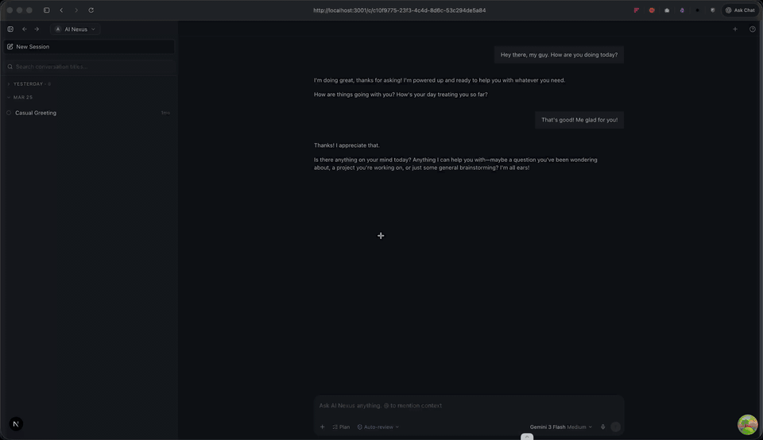

# Pawrrtal

<p align="center">
  <a href="docs/assets/header.mp4" title="Click for the full-resolution MP4">
    
  </a>
</p>

[](https://biomejs.dev/)
[](https://biomejs.dev)
[](https://biomejs.dev)

Full-stack AI chatbot with real-time streaming responses, built with **Next.js 16** and **FastAPI**. Uses the **Agno** agentic framework with **Google Gemini** for conversational AI, featuring persistent conversation history, secure authentication, and a modern chat UI.

## Features

- **Real-time Streaming** - Chunk-by-chunk AI responses via Server-Sent Events (SSE)
- **Conversation Management** - Create, list, and resume multiple conversations with auto-generated titles
- **Model Selection** - Choose between available AI models from a dropdown
- **Secure Authentication** - JWT-based auth with httpOnly cookies via FastAPI-Users
- **User Preferences** - Custom instructions, accent color, and font size settings
- **API Key Management** - Encrypted storage for provider API keys (Fernet encryption)
- **Dual Database Architecture** - App metadata in SQLite + Agno-managed message history
- **Modern UI** - Responsive chat interface with Radix UI, Shadcn, and Tailwind CSS 4

## Tech Stack

| Layer    | Technology                         |
| -------- | ---------------------------------- |
| Frontend | Next.js 16, React 19, Tailwind 4   |
| Backend  | FastAPI, Python 3.13, Uvicorn      |
| AI/LLM   | Agno framework, Google Gemini      |
| Auth     | FastAPI-Users (JWT httpOnly cookies)|
| Database | SQLite + aiosqlite (async ORM)     |
| UI       | Radix UI, Shadcn                   |
| Tooling  | Bun, uv, Biome, Just, Lefthook    |

## Quick Start

### Prerequisites

- [Bun](https://bun.sh) (JavaScript runtime & package manager)
- [uv](https://docs.astral.sh/uv/) (Python package manager)
- Python 3.13+
- Google Gemini API key

### Installation

```bash
# Clone the repository
git clone https://github.com/OctavianTocan/pawrrtal.git
cd pawrrtal

# Install all dependencies
just install

# Configure environment
cp backend/.env.example backend/.env
cp frontend/.env.example frontend/.env
# Edit .env files with your API keys
```

### Development

```bash
# Start both frontend and backend
just dev

# Or use bun directly
bun dev
```

Frontend runs at [http://localhost:3001](http://localhost:3001), backend at [http://localhost:8000](http://localhost:8000).

## Environment Variables

### Backend (`backend/.env`)

```bash
AUTH_SECRET=your-jwt-secret        # Required: JWT signing key
GOOGLE_API_KEY=your-gemini-key           # Required: Google AI API key
CLAUDE_CODE_OAUTH_TOKEN=your-claude-token  # Required for Claude models
FERNET_KEY=your-fernet-key         # Required: API key encryption
ENV=dev                            # Optional: 'dev' or 'prod'
DATABASE_URL=sqlite+aiosqlite:///./app.db  # Optional: database path
CORS_ORIGINS=http://localhost:3001 # Optional: allowed origins
```

### Frontend (`frontend/.env`)

```bash
NEXT_PUBLIC_API_URL=http://localhost:8000
```

## Project Structure

```
pawrrtal/
├── backend/             # FastAPI Python backend
│   ├── main.py          # App entry point
│   └── app/
│       ├── api/         # Route handlers (chat, conversations, models)
│       ├── core/        # Config, agent factory
│       ├── crud/        # Database operations
│       ├── models.py    # ORM models
│       ├── schemas.py   # Pydantic schemas
│       ├── users.py     # Auth configuration
│       └── db.py        # Database setup
├── frontend/            # Next.js React frontend
│   ├── app/             # App Router pages & layouts
│   ├── features/        # Feature modules (chat)
│   ├── components/      # UI components (ai-elements, shadcn)
│   ├── hooks/           # Custom React hooks
│   └── lib/             # Utilities, types, API client
├── justfile             # Task runner commands
└── dev.ts               # Dev server orchestrator
```

## Commands

```bash
just dev       # Start frontend + backend dev servers
just test      # Run backend tests (pytest)
just lint      # Lint and auto-fix with Biome
just format    # Format with Biome
just check     # Read-only Biome check
just install   # Install all dependencies
just clean     # Remove build caches
```

## API Overview

| Endpoint                      | Method | Description              |
| ----------------------------- | ------ | ------------------------ |
| `/auth/register`              | POST   | User registration        |
| `/auth/jwt/login`             | POST   | User login               |
| `/api/v1/conversations`       | GET    | List conversations       |
| `/api/v1/conversations`       | POST   | Create conversation      |
| `/api/v1/conversations/:id`   | GET    | Get conversation details |
| `/api/v1/chat`                | POST   | Stream chat response (SSE)|
| `/api/v1/models`              | GET    | List available models    |

## Architecture

```
┌─────────────┐     ┌─────────────┐     ┌─────────────┐
│   Browser    │────►│  Next.js    │────►│  FastAPI     │
│              │ SSE │   :3001     │     │   :8000      │
└─────────────┘◄────└─────────────┘     └──────┬───────┘
                                               │
                                    ┌──────────┼──────────┐
                                    ▼          ▼          ▼
                              ┌─────────┐ ┌────────┐ ┌────────┐
                              │  Agno   │ │ App DB │ │Agno DB │
                              │+ Gemini │ │(SQLite)│ │(SQLite)│
                              └─────────┘ └────────┘ └────────┘
```

## License

MIT
